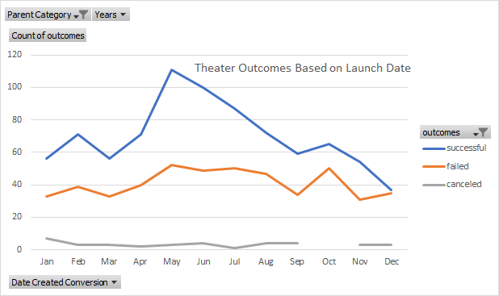
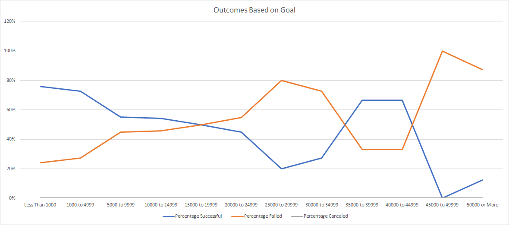

# Kickstarting with Excel

## Overview of Project
This project was focused on determining the optimal months for launching a Kickstarter, as well as determining 
which fundraising goals were most likely to be fully supported.
### Purpose
Use data analysis and visualization techniques to generate meaningful results that can be leveraged for 
business decisions
## Analysis and Challenges

### Analysis of Outcomes Based on Launch Date

An assessment of the outcomes based on launch date was performed by filtering via Pivot Table the data until it was just theater, cumulative outcome, and the months.

### Analysis of Outcomes Based on Goals

An assessment of the outcomes based on the target fundraising goal was performed by selecting only data that pertained to plays and then organizing the data based on fundraising goal quantity. COUNTIFS function was used for filtering.

### Challenges and Difficulties Encountered
1. A challenge for me was that I didn't know about grouping in Pivot tables before this lesson, so my data was only in years at first.
2. On the outcomes based on goals section, I had written the script to assess the pledged amount, not the goals amount. This led to errors and debugging was required.the 

## Results

- What are two conclusions you can draw about the Outcomes based on Launch Date?
  1. Visualization of the successful and unsuccessful launch dates shows that a product launched in the April to August time frame will have a higher likelihood of success if it is a standard launch, ie not an outlier.
  2. December is typically the worst month to launch a Kickstarter campaign. In December, a campaign is approximately just as likely to fail as to succeed. 

- What can you conclude about the Outcome based on Goals?
  1. Campaigns are most likely to succeed if the goal is less that $1000
  2. The worst range to target for a campaign goal is $45,000 to $49,999

- What are some limitations of this dataset?
  1. The data only goes back as far as 2017 and as the world is much more digital, the trends have likely changed significantly.
  2. There is no granularity in the data that shows momentum over the course of the kickstarter campaign. This data could be leveraged to determine optimal fundraising methods.

- What are some other possible tables and/or graphs that we could create?
  1. An analysis of the staff_pick vs outcome to see if the choice of the staff could indicate the success of a fundraiser early on.
  2. Key word search in the title or blurb that might indicate a higher likelihood of success.
